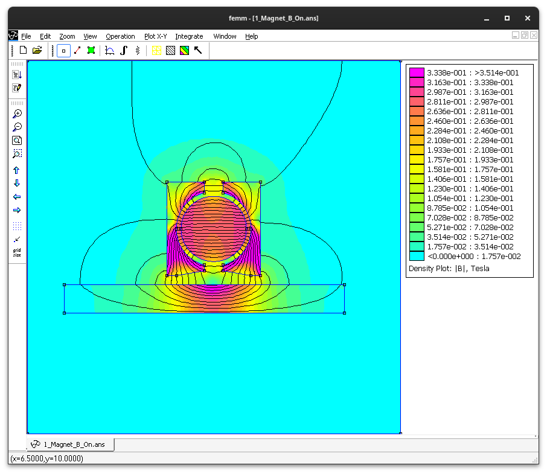
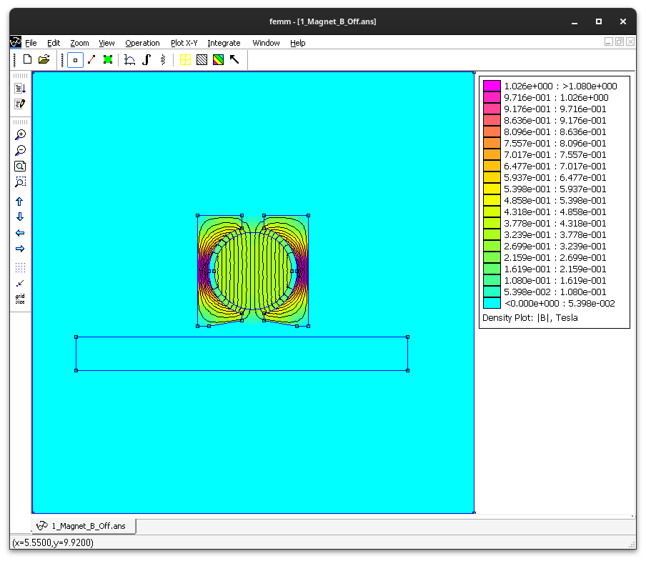

# femm

FEMM - Finite Element Method Magnetic

MagnetoStatic Simulations of Magnetic Circuits with FerroMagnetic Materials, Coils and Magnets.

## On_Off_Magnet - Switchable Magnet
One Magnet ON.

One Magnet OFF.

One Magnet B ON.

One Magnet B OFF.

Two Magnets ON.

Two Magnets OFF.

